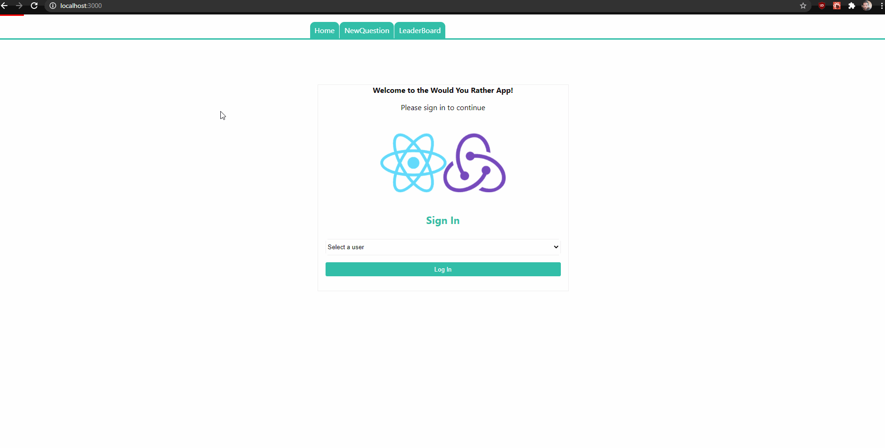
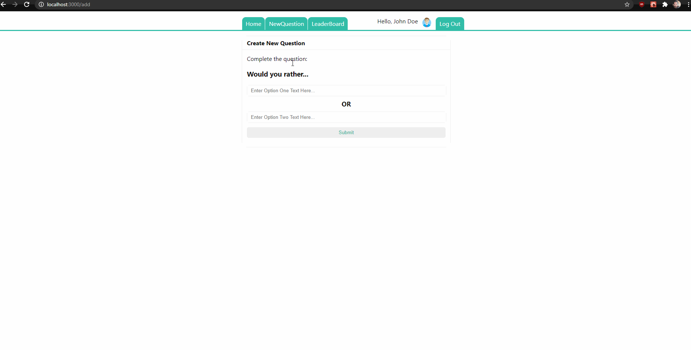
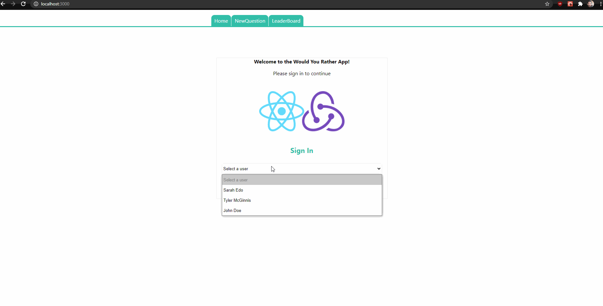

# WouldYouRather App

- Final exam from Udacity's Ract & Redux course.

Would You Rather is an APP that allows you to impersonate and log in into three different users and navigate between Answered/Unanswered questions, as well as create a New Question and consult the Leader Boards.

It started out from scratch with only a DATA_STRUCTURE and pre built functions to get data.
It was then converted to a react APP with 9 components, using REDUX connecting them to the STORE, in order to access information, and dispatching Actions and Reducers to modify th state, providing an unmutable state.

Consult the **rubric** for specifics. (https://review.udacity.com/#!/rubrics/1567/view)
  
## Getting Started  

 install all project dependencies with `npm install`
 start the development server with `npm start`

#Breakthrough

## Users
###navigation through URL 
The backend is limited to only allow access to New Created questions through menu navigation, including signing out and into different users, which means that if you try to access a newly created question through its URL it won't work.
to deal with this problem it was created a "Not Found" page

###Preview
*This is a preview of how the Login Logout works.*

*This is a preview of how the Dashboard and Questions Details / voting works*

*This is a preview of the LeaderBoard changing based on the actions taken*

*This is a rsult of trying to acces a newly created Question through its URL*
